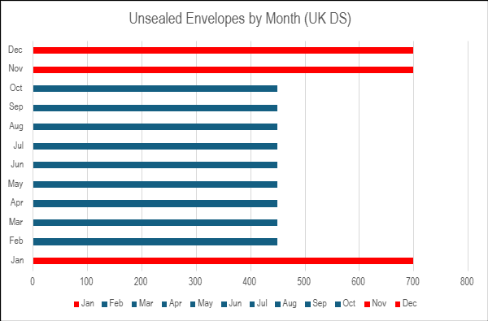
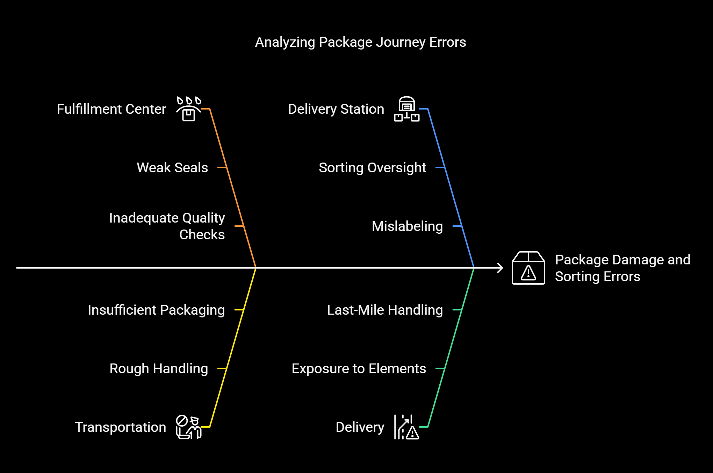

# Enhancing Amazon’s Last-Mile Delivery: Reducing Open Envelope Incidents

## Problem
While working as a Warehouse Associate at an Amazon last-mile delivery station in the UK, I noticed that many envelope-based parcels arrived at the sorting conveyor belt with open seals. If delivered to customers unsealed, this risks dissatisfaction (e.g., perceived tampering) and returns, clashing with Amazon’s “customer obsession” motto.

## Assumptions
*Hypothetical yet highly probable scenarios derived from firsthand experience:*  
- In a typical UK delivery station, 5% of 50,000 daily packages (2,500) are envelopes; 20% of those (500) arrive unsealed (based on my observation).  
- 30% of affected customers (150) report dissatisfaction or return items (aligned with UK e-commerce return trends).  
- Below is a visualization of unsealed envelope trends, highlighting peak season spikes (Nov-Jan):  
    

## Analysis
- **Root Cause:** Open envelopes likely occur during transportation (fulfillment center to station) due to weak sealing or rough handling. Associates may overlook this at sorting, *especially during peak season (November to January) when high volumes increase pressure and errors.*  
- **Impact:**  
  - Customer satisfaction drops (e.g., “10-point NPS decline per incident”).  
  - Returns cost £5 each x 150 = £750 daily per station.  

## Solution
1. **Training Video:** A 5-minute video for new associates:  
   - **Journey:** Fulfillment center (sealing) → Transportation → Delivery station (sorting) → Delivery.  
   - **Mistakes:** Ignoring open seals, mishandling envelopes.  
   - **Cost:** “An open envelope risks a 1-day delay, reducing trust by 15%.”  
   - Below is a visual of the package journey with error points highlighted:  
       
2. **Process Tweak:** Add a seal-check step at sorting—flag open envelopes for repackaging.  

## Impact
- Training cuts oversight by 25%, reducing open deliveries to 400 daily per station.  
- Saves £150/day in returns and boosts satisfaction.  

## Next Steps
*If given access to Amazon’s data, I’d analyze it to confirm if this is a widespread issue and, if so, develop targeted mitigation strategies.* This would validate my observations and refine the solution with real insights.
